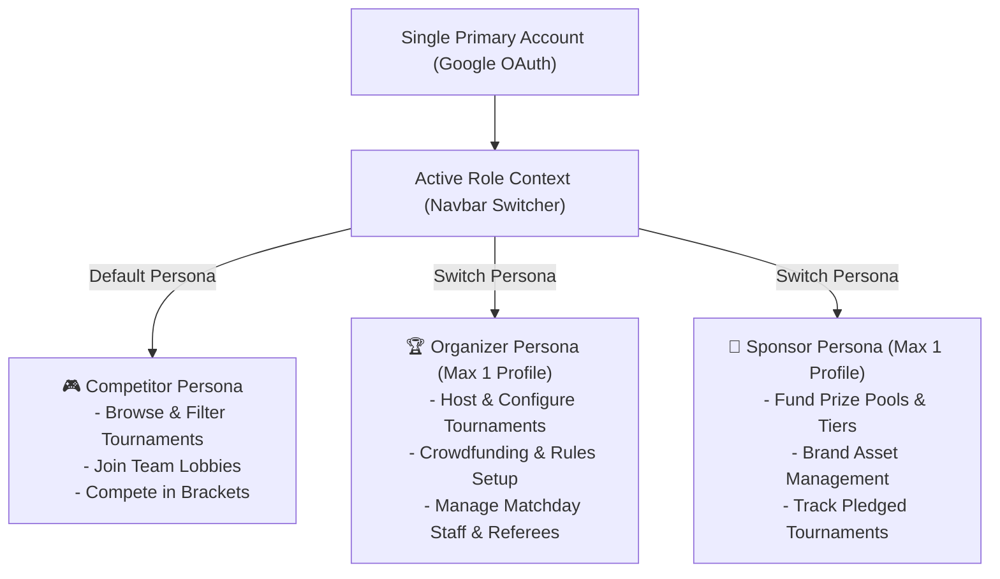
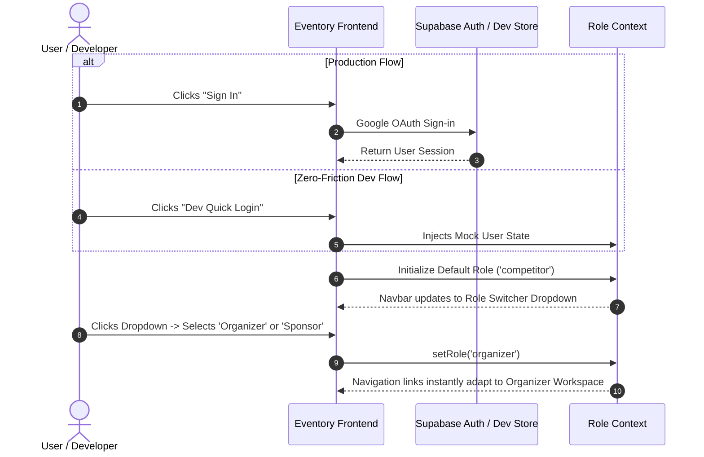
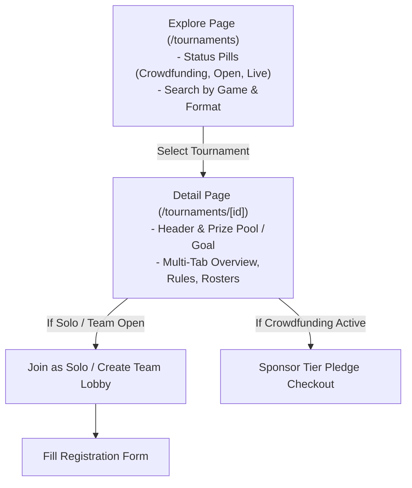
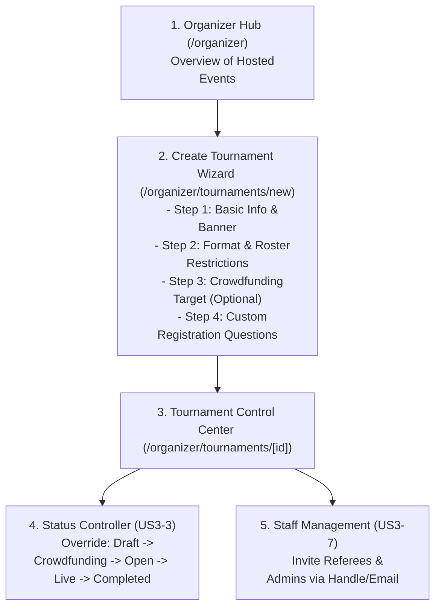
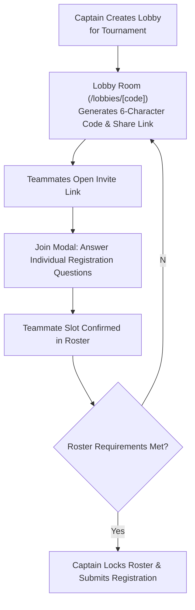

# Eventory Frontend: User Journeys & Page Map (Sprint 1)

> **Document Purpose:** This document defines the initial user journeys, page architecture, and routing blueprint for the **Eventory** frontend. Use this specification to align development tasks across team members.

---

## 1. System Architecture & Core Concept

Eventory is a tournament, competition, and crowdfunding platform built with a **Single Primary Identity** and **Contextual Persona Switching**.

---

## 2. Core User Journeys (Sprint 1)

### Journey 1: Authentication & Role Switching (EPIC 1: US1-1, US1-2, US1-3)

---

### Journey 2: Tournament Discovery & Overview (EPIC 2: US2-1, US2-2)

---

### Journey 3: Organizer Tournament Hosting & Lifecycle (EPIC 3: US3-1, US3-2, US3-3, US3-7)

---

### Journey 4: Team Formation & Lobby Room (EPIC 4: US4-1, US4-2)

---

## 3. Sprint 1 Page Map & Route Specifications

Below is the complete table of routes required for Sprint 1. Each route has a single clear purpose, mapped to specific user stories:

| Route Path | Page Name | Persona / Access | Mapped User Story | Core Components & UI Features |
| :--- | :--- | :--- | :--- | :--- |
| `/` | **Landing / Home** | Public / All | - | Clean Hero title, Value proposition, Primary CTAs (`Explore Tournaments`, `Host Tournament`). |
| `/login` | **Authentication** | Public (Unauthed) | **US1-1** | Single-click "Sign in with Google" card + "Dev Quick Login" fallback button. |
| `/onboarding` | **Handle Setup** | Authenticated | **US1-1** | First-login profile setup: Display Name & Avatar confirmation. |
| `/tournaments` | **Tournament Explore** | All (Competitor focus) | **US2-1** | Search bar, Status filter pills (`Crowdfunding`, `Registration Open`, `Live`, `Completed`), Game tags, Tournament Cards with funding/roster progress bars. |
| `/tournaments/[id]` | **Tournament Detail** | All | **US2-2** | Hero banner, Organizer identity, Funding progress bar (if crowdfunding), Tabbed content (Overview, Rules & Format, Participants/Teams, Sponsors), CTA button. |
| `/lobbies/[code]` | **Team Lobby Room** | Competitor (Teams) | **US4-1, US4-2** | 6-character room code with copy link, Roster slot cards, Member question completion status indicator, Captain controls (Kick, Regenerate Code, Lock Roster). |
| `/organizer` | **Organizer Hub** | Organizer | **US3-2** | Dashboard summarizing hosted tournaments, live participant counts, active funding campaigns, "+ Create Tournament" CTA. |
| `/organizer/tournaments/new` | **Create Tournament** | Organizer | **US3-1** | 4-step wizard: 1) General Info, 2) Tournament Format/Rules/Fee, 3) Crowdfunding Target/Tiers, 4) Registration Form Question Builder. |
| `/organizer/tournaments/[id]` | **Tournament Manager** | Organizer | **US3-2, US3-3, US3-7** | Key metrics, Lifecycle Status Transition selector (Status Override), Staff and Referee invitation table with role assignment. |
| `/sponsor` | **Sponsor Dashboard** | Sponsor | **US1-2, US5-5** | Pledged tournaments overview, brand asset preview (Logo, Website redirect link), sponsorship tier tracker. |
| `/settings` | **Profile & Settings** | Authenticated | **US1-2, US1-3** | Tabbed settings: 1) Personal Profile, 2) Organizer Profile (Club name, Bio, Logo), 3) Sponsor Profile (Company name, Website, Logo). |

---

## 4. Team Work Breakdown (How to Divide the Work)

To prevent merge conflicts, team members can be assigned by feature domain:

---

## 5. Peer Review Checklist for Teammates

- [ ] Does the **3-Persona Context Switcher** (Competitor / Organizer / Sponsor) fit our platform vision?
- [ ] Are the **4 core flows** (Auth, Discovery, Organizer Lifecycle, Team Lobby) clear and sufficient for Sprint 1?
- [ ] Is the page routing structure logical and easy to navigate?
- [ ] Are there any missing pages or duplicate responsibilities in the list above?
